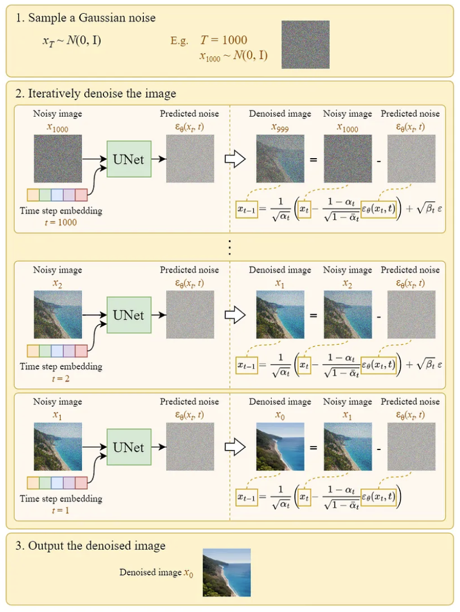

# 概率扩散模型 (Diffusion Probabilistic Models, DPM)

## 1. 概率扩散模型 (Diffusion Probabilistic Models, DPM)

2015年，由 Jascha Sohl-Dickstein 和 Eric 等人提出了概率扩散模型（diffusion probabilistic model,DPM），可以简称为扩散模型（diffusion model,DM）。

### 1.1.  概率扩散模型 (Diffusion Probabilistic Models, DPM) 介绍

扩散模型示意图如下所示：

Figure 1：$\ x_0$ 是 clean image，它的概率分布 $\ p(x_0) $ 未知， $\ x_T $ 的概率分布 $\ p(x_T)$ 是标准的正态分布；扩散模型分为2步：向前扩散 $\ q(x_t|x_{x-1})$ ，和逆向采样 $\ p(x_{t-1}|x_t)$ 。

向前扩散（编码）： $\ q(x_t|x_{x-1})$ 固定为线性高斯变换，只需要给定超参数的值，它是对clean image 逐步加噪声的过程，直到图像变成标准的正态分布；逆向采样（解码）： $\ p(x_{t-1}|x_t)$ 需要使用神经网络进行拟合，它是对高斯噪声逐步采样的过程，直到噪声变为 clean image。

整个网络的联合概率分布可表示为 $\ p(x_{0:T})$ ，按照从左到右向前扩散的顺序对联合概率进行分解:
$$
p(x_{0:T}) = q(x_0)\prod_{t=1}^{T}q(x_t|x_{t-1})
$$
也可以对联合概率分布 $\ p(x_{0:T})$ 按照从右到左向后采样的顺序进行分解：
$$
p(x_{0:T})=p(x_T)\prod_{t=1}^{T}p(x_{t-1}|x_t)
$$

#### 向前扩散过程

真实图像$\ x_0$ 的真实概率分布 $\ p(x_0)$ 的概率密度函数是未知的，但$\ x_0$ 的值是已知的，这里$\ x_0 $ 被称为观测样本，$\ x_{1:T}$ 是未知的隐变量，这时网络的向前扩散过程的表达式如下：
$$
q(x_{1:T}|x_0)=\prod_{t=1}^{T}q(x_t|x_{t-1})
$$
这里假设每一个$\ x_t$ 都是一个高斯变量，向前过程$\ q(x_t|x_{t-1})$ 是线性高斯模型，即$\ x_t$ 均值和 $\ x_{t-1}$ 的值是线性关系。$\ q(x_t|x_{t-1})$ 的方差与 $\ x_{t-1}$ 是独立的，并且为 $\ \beta_t\mathbf{I}$ ，其中 $\ 0<\beta_1<\beta_2<...<\beta_T<1$ 。这么做的意义：**前期方差较小，添加的噪声少，扩散速度慢；随着方差逐步加大，添加的噪声越来越多，扩散的速度加快。**$\ \beta_t$​ 是超参数，不需要学习得到。

$\ x_t$ 均值和 $\ x_{t-1}$ 的值是线性关系，$\ \mu_t(x_t) = \sqrt\alpha_tx_{t-1}$ ，$\ x_t$ 的方差与 $\ x_{t-1}$ 无关， $\ \sum_{x_t} = (1-\alpha_t)\mathbf{I}$ ，其中 $\ \alpha_t = 1- \beta_t$ 。因为$\ q(x_t|x_{t-1})$ 是线性高斯模型，所以:
$$
q(x_t|x_{t-1}) \sim N(x_t; \sqrt\alpha_tx_{t-1}, (1-\alpha_t)\mathbf{I}) \\
x_t = \sqrt\alpha_tx_{t-1} + \sqrt{1-\alpha_t}\epsilon_t
$$
这里可以直接根据 $\ x_0$ 计算得到 $\ x_t$ :
$$
\begin{aligned}
x_t &= \sqrt{\alpha_t}\ x_{t-1} + \sqrt{1-\alpha_t}\ \epsilon_t \\
    &=\sqrt{\alpha_t}(\sqrt{\alpha_{t-1}}\ x_{t-2} + \sqrt{1-\alpha_{t-1}}\ \epsilon_{t-1}) + \sqrt{1-\alpha_t}\ \epsilon_t \\
    &= \sqrt{\alpha_t\alpha_{t-1}}\ x_{t-2} + \underbrace{\sqrt{\alpha_t-\alpha_t\alpha_{t-1}}\ \epsilon_{t-1} + \sqrt{1-\alpha_t}\ \epsilon_t}_{两个分布相互独立的高斯分布} \\
    &= \sqrt{\alpha_t\alpha_{t-1}}\ x_{t-2} + \underbrace{\sqrt{\sqrt{\alpha_t-\alpha_t\alpha_{t-1}}^2 + \sqrt{1 - \alpha_t}^2}\ \epsilon}_{两个标准差相加，得到一个新的高斯分布} \\
    &= \sqrt{\alpha_t\alpha_{t-1}}\ x_{t-2} + \sqrt{1-\alpha_t\alpha_{t-1}}\ \epsilon \\
    &= ... \\
    &= \sqrt{\prod_{i=1}^{t}\alpha_i}\ x_0 + \sqrt{1 - \prod_{i=1}^{t}\alpha_i}\ \epsilon \\
    &= \sqrt{\bar{\alpha_t}}\ x_0 + \sqrt{1-\bar{\alpha_t}}\ \epsilon ,\quad \bar{\alpha_t}=\prod_{i=1}^{t}\alpha_i, \quad \epsilon \sim N(0, \mathbf{I}) \\
    &\sim N(\sqrt{\bar{\alpha_t}}\ x_0，(1-\bar{\alpha_t})\mathbf{I})
\end{aligned}
$$
根据以上公式可以通过 $\ x_0$ 计算出不同 $\ t$ 时刻的 $\ x_t$ 的值。**这里有一点疑问**：向前过程是马尔科夫链，即当前状态只与上个状态有关，为什么当前状态的值可以直接通过初始状态 $\ x_0$ 得到？

#### 逆向采样过程

逆向过程是从右往左的解码过程，将 $\ x_T$ 逐步解码去噪生成一张图片的过程，逆向过程也是一个马尔科夫链，逆向过程的每一步的真实分布为 $\ p(x_{t-1}|x_t)$ , 从右往左逆向过程去分解网络的联合概率分布如下：
$$
p(x_{0:T})=p(x_T)\prod_{t=1}^{T}p(x_{t-1}|x_t)
$$
真实分布 $\ p(x_{t-1}|x_t)$ 难以计算，这里用神经网络 $\ p_\theta(x_{t-1}|x_t)$ 去拟合解码过程 $\ p(x_{t-1}|x_t)$ 的近似分布，$\ \theta$ 为需要学习的参数。和VAE相同，这里使用最大化 ELBO 来进行参数学习。

总结一下（如下）：正向过程（Forward Diffusion) -> 对图片逐步加噪的过程；

​                   		逆向过程（Reverse Diffusion) -> 对随机高斯噪声逐步降噪得到干净图片的过程。

### 1.2. 证据下界(Evidence Lower Bound,ELBO)

通常情况下可以使用极大似然估计求解一个概率分布的未知参数，根据似然理论，可以极大化观测样本的发生概率求解模型的参数，已知网络的的观测数据 $\ x_0$ , 隐变量 $\ x_{1:T}$ 是未知的， $\ p(x_0)$ 可以对联合概率分布 $\ p(x_{0:T})$ 积分得到：
$$
p(x_0)=\int p(x_{0:T}) dx_{1:T}
$$
假设观测数据 $\ X = \{{x_{0}^{(0)}, x_{0}^{(1)}, ..., x_{0}^{(N)}}\}$，那么极大化的目标函数（对数似然函数）为：
$$
\mathop{arg\max} \limits_{\theta} \log{\sum_{i=0}^{N}p(x_{0}^{i})}
$$
#### 最大下界函数计算

为方便计算，可以去除累加符号，直接计算 $\ \mathop{arg\max} \limits_{\theta}\ \log{p(x_0)}$ ，但是对其进行极大化比较困难，我们可以找到一个下界函数永远小于等于对数似然函数，这个下界函数即为证据下界函数（EBLO）。我们先计算 $\ \log p(x_0)$  ：
$$
\begin{aligned}
\log p(x_0) &= \log {\int p(x_{0:T})dx_{1:T}} \\
&= \log {\int \frac{p(x_{0:T}) q(x_{1:T}|x_0)} {q(x_{1:T}|x_0)} dx_{1:T}} \\
&= \log {\mathbb{E}_{q(x_{1:T}|x_0)} \left[\frac {p(x_{0:T})}{q(x_{1:T}|x_0)}\right]}  \\
&\geq \mathbb{E}_{q(x_{1:T}|x_0)} \left[\log \frac {p(x_{0:T})}{q(x_{1:T}|x_0)} \right] \qquad 根据Jesten不等式 \\
&= \mathbb{E}_{q(x_{1:T}|x_0)} \left[\log \frac {p(x_T)\prod_{t=1}^{T}p_{\theta}(x_{t-1}|x_t)}{\prod_{t=1}^{T}q(x_t|x_{t-1})}\right] \\
&= \mathbb{E}_{q(x_{1:T}|x_0)} \left[\log \frac {p(x_T)p_{\theta}(x_0|x_1) \prod_{t=2}^{T}p_{\theta}(x_{t-1}|x_t)}{q(x_T|x_{T-1}) \prod_{t=1}^{T-1}q(x_t|x_{t-1})} \right] \\
&= \mathbb{E}_{q_(x_{1:T}|x_0)} \left[\log \frac {p(x_T)p_{\theta}(x_0|x_1) \prod_{t=1}^{T-1}p_{\theta}(x_t|x_{t+1})}{q(x_T|x_{T-1}) \prod_{t=1}^{T=1} q(x_t|x_{t-1})} \right] \\
&= \mathbb{E}_{q(x_{1:T}|x_0)} \left[\log {p_{\theta}(x_0|x_1)} \right] + \mathbb{E}_{q(x_{1:T}|x_0)} \left[\log \frac{p(x_T)}{q(x_T|x_{T-1})} \right] + \mathbb{E}_{q(x_{1:T}|x_0)} \left[\log \prod_{t=1}^{T-1} \frac{p_{\theta}(x_t|x_{t+1})}{q(x_t|x_{t-1})} \right] \\
&= \underbrace{\mathbb{E}_{q(x1|x0)} \left[\log p_{\theta}(x_0|x_1) \right]}_{只含x_0和x_1,因此积分 x_{2:T}可去除} + \mathbb{E}_{q(x_{T-1},x_T|x_0)} \left[\log \frac{p(x_T)}{q(x_T|x_{T-1})} \right] + \sum_{t=1}^{T-1} \mathbb{E}_{q(x_{1:T}|x_0)} \left[\log \frac{p_{\theta}(x_t|x_{t+1})}{q(x_t|x_{t-1})} \right] \\
&= \mathbb{E}_{q(x1|x0)} \left[\log p_{\theta}(x_0|x_1) \right] + \mathbb{E}_{q(x_{T-1}|x_0)} \mathbb{E}_{p(x_{T}|x_{T-1})} \left[\log \frac{p(x_T)}{q(x_T|x_{T-1})} \right] + \sum_{t=1}^{T-1} \mathbb{E}_{q(x_{t-1}, x_t, x_{t+1}|x_0)} \left[\log \frac{p_{\theta}(x_t|x_{t+1})}{q(x_t|x_{t-1})} \right] \\
&= \mathbb{E}_{q(x1|x0)} \left[\log p_{\theta}(x_0|x_1) \right] - \mathbb{E}_{q(x_{T-1}|x_0)} \left[D_{KL}(q(x_T|x_{T-1}||p(x_T)) \right] + \sum_{t=1}^{T-1} \mathbb{E}_{q(x_{t-1}, x_{t+1}|x_0)} \mathbb{E}_{q(x_t|x_{t-1})} \left[\log \frac{p_{\theta}(x_t|x_{t+1})}{q(x_t|x_{t-1})} \right] \\
&= \underbrace{\mathbb{E}_{q(x1|x0)} \left[\log p_{\theta}(x_0|x_1) \right]}_{reconstruction\ term} - \underbrace{\mathbb{E}_{q(x_{T-1}|x_0)} \left[D_{KL}(q(x_T|x_{T-1}||p(x_T)) \right]}_{prior\ matching\ term} - \sum_{t=1}^{T-1} \underbrace{\mathbb{E}_{q(x_{t-1}, x_{t+1}|x_0)} \left[D_{KL}(q(x_t|x_{t-1})||p_{\theta}(x_t|x_{t+1})) \right]}_{consistency\ term}
\end{aligned}
$$
以上是对EBLO函数处理后的3个组成部分：

1. $\ \mathbb{E}_{q(x_1|x_0)} \left[\log p_{\theta}(x_0|x_1) \right]$ 为重建项（reconstruction term），这里可以理解为用 $\ x_0$ 得到 $\ x_1$ ，在用 $\ x_1$ 重建 $\ x_0$ ，让重建后的 $\ x_0$ 和原来的 $\ x_0$ 尽量接近。由于这里给的是概率形式，给定 $\ x_0$ ，我们可以从 $\ q(x_1|x_0)$ 中采样出 $\ x_1$ ，在用 $\ x_1$ 来计算 $\ \log p_{\theta}(x_0|x_1)$，如果这一项足够大，就说明给定 $\ x_1$ 重建出来的条件概率 $\ p_{\theta}(x_0|x_1)$ 里的 $\ x_0$ 较大，说明 $\ x_0$ 被重建的比较好。这里详细的解释下$\ \mathbb{E}_{q(x_1|x_0)} \left[\log p_{\theta}(x_0|x_1) \right]$ 的含义：

   
   $$
   \begin{aligned}
   &\quad \ \ \mathbb{E}_{q(x_1|x_0)} \left[\log p_{\theta}(x_0|x_1) \right] \\
   &=\int{\log p_{\theta}(x_0|x_1) \cdot q(x_1|x_0)} dx_1 \\
   &\approx \frac{1}{n}\sum_{i=0}^n\log p_{\theta}(x_0|x_1^{(i)}), \ x_1^{(i)} \sim q(x_1|x_0) \quad 从q(x_1|x_0) 中随机采样x_1的值，再计算\log p_{\theta}(x_0|x_1)
   \end{aligned}
   $$
   
2. 为先验匹配项（prior matching term），可以理解为向前过程 $\ x_0$ 到 $\ x_{T-1}$ 再由 $\ x_{T-1}$ 得到 $\ x_T$ 的条件概率 $\ q(x_T|x_{T-1})$ 与 先验概率 $\ p(x_T)$ 的匹配程度。这里我们假设当$\ T$ 足够大时，最终潜在变量 $\ x_T$ 为标准的正态分布，所以 $\ p(x_T)$ 就是标准的正态分布，这一项为值就是0，没有需要学习的参数，因此这一项可以忽略。

3. $\ \mathbb{E}_{q(x_{t-1}, x_{t+1}|x_0)} \left[D_{KL}(q(x_t|x_{t-1})||p_{\theta}(x_t|x_{t+1})) \right]$ 为一致性项（consistency term），这一项可以理解为以从$\ q(x_{t-1}, x_{t+1}|x_0)$ 中采样出 $\ x_{t-1}, x_{t+1}$ ,再以 $\ x_{t-1}, x_{t+1}$ 为条件，求得 $\ x_t$ 的条件概率 $\ q(x_t|x_{t-1})$ 和 $\ p_{\theta}(x_t|x_{t+1})$ 。最大化似然函数 $\ log \ p(x_0)$，就要最小化一致性项，可以理解为拟合逆向过程的参数 $\ \theta$ ，使得 $\ p_{\theta}(x_t|x_{t+1})$ 和 $\ q(x_t|x_{t-1})$ 的分布尽量相似，即解码器 $\ p_{\theta}(x_t|x_{t+1})$ 求得的 $\ x_t$ 和编码器 $\ q(x_t|x_{t-1})$ 求得的 $\ x_t$ 的值要尽量一致 。如下图所示：

   

$\ \mathbb{E}_{q(x_1|x_0)}$ ，$\ \mathbb{E}_{q(x_{T-1}|x_0)}$， $\ \mathbb{E}_{q(x_{t-1}, x_{t+1}|x_0)}$ ， 指以 $\ x_0$ 为条件，从向前扩散的条件概率中采样出隐变量 $\ x_1, x_{t-1}, x_{t+1}, x_{T-1}$​​ ，因为隐变量为随机变量，没有具体的值，所以需要先采样出隐变量（求期望或积分），再计算以隐变量为条件的概率分布。

#### 最大下界函数改进

在上述公式 (9) 中，先验匹配项$\ \mathbb{E}_{q(x_1|x_0)} \left[\log p_{\theta}(x_0|x_1) \right]$ 可以忽略，重建项 $\ \mathbb{E}_{q(x_1|x_0)} \left[\log p_{\theta}(x_0|x_1) \right]$ 的计算也较为简单，但是 一致性项$\ \mathbb{E}_{q(x_{t-1}, x_{t+1}|x_0)} \left[D_{KL}(q(x_t|x_{t-1})||p_{\theta}(x_t|x_{t+1})) \right]$ 在每个 timestep 都需要采样出 $\ \{x_{t-1},x_{t+1}\}$​ 去计算期望会导致优化过程不稳定，不容易收敛，因此我们可以对以上公式进行优化。

根据条件独立性原则，以下公式成立：
$$
\begin{equation}
q(x_t|x_{t-1}) = q(x_t|x_{t-1}, x_0)
\end{equation}
$$
根据贝叶斯定理，可得到：
$$
q(x_t|x_{t-1}, x_0)=\frac{q(x_{t-1}|x_t, x_0)q(x_t|x_0)}{q(x_{t-1}|x_0)}
$$
这里我们可以对公式 (9) 进行修改：
$$
\begin{aligned}
\log p(x_0) &= \log \int{p(x_{0:T})}dx_{1:T} \\
&= \log \int{\frac{p(x_{0:T})q(x_{1:T}|x_0)}{q(x_{1:T}|x_0)}} dx_{1:T} \\
&= \log \mathbb{E}_{q(x_{1:T}|x_0)} \left[\frac{p(x_{0:T})}{q(x_{1:T}|x_0)} \right] \\
&\geq \mathbb{E}_{q(x_{1:T}|x_0)} \left[\log \frac{p(x_{0:T})}{q(x_{1:T}|x_0)} \right] \\
&= \mathbb{E}_{q(x_{1:T}|x_0)} \left[\log \frac{p(x_T)\prod_{t=1}^{T}p_{\theta}(x_{t-1}|x_t)}{\prod_{t=1}^{T}q(x_t|x_{t-1})} \right] \\
&= \mathbb{E}_{q(x_{1:T}|x_0)} \left[\log \frac{p(x_T)p_{\theta}(x_0|x_1) \prod_{t=2}^{T}p_{\theta}(x_{t-1}|x_t)}{q(x_1|x_0) \prod_{t=2}^{T}q(x_t|x_{t-1})} \right] \\
&= \mathbb{E}_{q(x_{1:T}|x_0)} \left[\log \frac{p(x_T)p_{\theta}(x_0|x_1)}{q(x_1|x_0)} + \log \frac{\prod_{t=2}^{T}p_{\theta}(x_{t-1}|x_t)}{\prod_{t=2}^{T} \frac{q(x_{t-1}|x_t, x_0)q(x_t|x_0)}{q(x_{t-1}|x_0)}} \right] \\
&= \mathbb{E}_{q(x_{1:T}|x_0)} \left[\log \frac{p(x_T)p_{\theta}(x_0|x_1)}{q(x_1|x_0)} - \log \prod_{t=2}^{T} \frac{q(x_t|x_0)}{q(x_{t-1}|x_0)} + \log \prod_{t=2}^{T} \frac{p_{\theta}(x_{t-1}|x_t)}{q(x_{t-1}|x_t, x_0)} \right] \\
&= \mathbb{E}_{q(x_{1:T}|x_0)} \left[\log \frac{p(x_T)p_{\theta}(x_0|x_1)}{q(x_1|x_0)} - \log \frac{q(x_T|x_0)}{q(x_1|x_0)} + \log \prod_{t=2}^{T} \frac{p_{\theta}(x_{t-1}|x_t)}{q(x_{t-1}|x_t, x_0)} \right] \\ 
&= \mathbb{E}_{q(x_{1:T}|x_0)} \left[\log \frac{p(x_T)p_{\theta}(x_0|x_1)}{q(x_T|x_0)} + \sum_{t=2}^{T}\log \frac{p_{\theta}(x_{t-1}|x_t)}{q(x_{t-1}|x_t, x_0)} \right] \\
&= \mathbb{E}_{q(x_{1:T}|x_0)} \left[\log p_{\theta}(x_0|x_1) \right] + \mathbb{E}_{q(x_{1:T}|x_0)} \left[\log \frac{p(x_T)}{q(x_T|x_0)} \right] + \sum_{t=2}^{T} \mathbb{E}_{q(x_{1:T}|x_0)} \left[\log \frac{p_{\theta}(x_{t-1}|x_t)}{q(x_{t-1}|x_t, x_0)} \right] \\
&= \mathbb{E}_{q(x_1|x_0)} \left[\log p_{\theta}(x_0|x_1) \right] + \mathbb{E}_{q(x_T|x_0)} \left[\log \frac{p(x_T)}{q(x_T|x_0)} \right] + \sum_{t=2}^{T} \mathbb{E}_{q(x_{t-1}, x_t|x_0)} \left[\log \frac{p_{\theta}(x_{t-1}|x_t)}{q(x_{t-1}|x_t, x_0)} \right] \\
&= \mathbb{E}_{q(x_1|x_0)} \left[\log p_{\theta}(x_0|x_1) \right] + \mathbb{E}_{q(x_T|x_0)} \left[\log \frac{p(x_T)}{q(x_T|x_0)} \right] + \sum_{t=2}^{T} \mathbb{E}_{q(x_t|x_0)} \mathbb{E}_{q(x_{t-1}|x_t, x_0)} \left[\log \frac{p_{\theta}(x_{t-1}|x_t)}{q(x_{t-1}|x_t, x_0)} \right] \\
&= \underbrace{\mathbb{E}_{q(x_1|x_0)} \left[\log p_{\theta}(x_0|x_1) \right]}_{reconstructino \ term} - \underbrace{D_{KL}(q(x_T|x_0)||p(x_T))}_{prior\ matching\ term} - \sum_{t=2}^{T} \underbrace{\mathbb{E}_{q(x_t|x_0)} D_{KL}(q(x_{t-1}|x_t, x_0)||p_{\theta}(x_{t-1}|x_t))}_{denoising\ matching\ term}
\end{aligned}
$$
公式 (16) 是对公式 (9) 的一个优化：

1. 重建项（reconstruction term）没有变化。

2. 先验匹配项（prior matching term）也是不含有学习参数，相当于常数项，这一项可以忽略。

3. 降噪匹配项（denoising matching term）：由于 $\ x_t$ 为隐变量，需要通过 $\ q(x_t|x_0)$ 对 $\ x_t$ 进行采样。$\ q(x_{t-1}|x_t, x_0) $ 是以 $\ x_0, x_t$ 为条件变量的概率分布，它代表着**逆向过程的真实分布**，$\ p_{\theta}(x_{t-1}|x_t)$ 代表这**逆向过程真实分布的拟合**，可以用神经网络进行拟合，因此拟合的概率分布 $\ p_{\theta}(x_{t-1}|x_t)$ 要尽量与真实的概率分布 $\ q(x_{t-1}|x_t, x_0)$ 相似，如下图所示：

   

下面对 reconstruction term, reconstruction term, denoising matching term 进行逐一计算。

**Reconstruction term**

因为向前扩散 $\ q(x_t|x_{t-1})$ 是线性高斯变化，属于高斯分布，所以逆向过程的真实分布 $\ q(x_{t-1}|x_t, x_0)$ 也是高斯分布，因此拟合逆向过程的真实分布的 $\ p_{\theta}(x_{t-1}|x_t)$ 定义为和 $\ q(x_{t-1}|x_t, x_0)$ 分布相同，也为高斯分布。 

这里 $\ p_{\theta}(x_0|x_1) $ 是依赖 $\ x_1$ 的高斯分布，记其均值为 $\ \mu_\theta(x_1, t=1)$ ，方差记作常量$\ \Sigma$ ,
$$
\begin{aligned}
\log p_{\theta}(x_0|x_1) &= \log \frac{1}{(2\pi)^{n/2}|\Sigma|^{1/2}}exp\{-\frac{1}{2}(x_0 - u_{\theta}(x_1, t=1))^{T}\Sigma^{-1}(x_0 - \mu_{\theta}(x_1, t=1)) \} \\
&\propto -\frac{1}{2}(x_0 - \mu_{\theta}(x_1, t=1))^T(x_0 - \mu_{\theta}(x_1, t=1)) \\
&= -\frac{1}{2}||x_0 - \mu_{\theta}(x_1, t=1)||_2^2
\end{aligned}
$$
极大化 $\ \log p_{\theta}(x_0|x_1)$ 就是极小化 $\ \mu_{\theta}(x_1, t=1) $ 和 $\ x_0$ 的均方误差，即模型相当于在预测 $\ x_0$ 的值，这里可以把 $\ \mu_{\theta}(x_1, t=1)$ 记作我 $\ x_0$  的估计 $\ \hat{x_0}(x_1, t=1)$ ，可以得出如下
$$
\begin{aligned}
& \mathop{arg\max} \limits_{\theta} \mathbb{E}_{q(x_1|x_0)} \left[\log p_{\theta}(x_0|x_1) \right] \\
& \Rightarrow \mathop {arg\max} \mathbb{E}_{q(x_1|x_0)} \left[-\frac{1}{2}||x_0 - \hat{x_0}(x_1, t=1)||^2 \right] \\
& \Rightarrow \mathop {arg\min} \mathbb{E}_{q(x_1|x_0)} \left [||x_0 - \bar{x_0}(x_1, t=1)||_2^2 \right]
\end{aligned}
$$
这里求期望是因为$\ x_1$ 是隐变量，要先采样出 $\ x_1$ 的值, 再进行计算$\ x_0$​ 的均方误差。

**Prior matching term**

$\ q(x_T|x_0)$ 是向前过程中$\ x_T$ 的后验分布，$\ p(x_T)$ 是逆向过程中 $\ x_T$ 的先验分布。这一项是约束 $\ x_T$ 的后验分布要和$\ x_T$ 的先验分布相似，而且这一项不含未知参数，相当于常数项，所以可以忽略。

**Denoising matching term**

这一项中$\ q(x_{t-1}|x_t, x_0)$ 是逆向分布的真实分布，因为 $\ q(x_t|x_{t-1}) $ 是高斯分布，根据**条件独立性**$\ q(x_{t-1}|x_t, x_0)$ 和 $\ q(x_{t-1}|x_t)$ 是一样的，所以$\ q(x_{t-1}|x_t, x_0)$ 也是高斯分布，其中$\ x_0$ , $\ x_t$ 为条件变量，$\ x_0$ 的值是已知的，$\ x_t$ 的值同过计算期望采样得到 ，所以$\ x_0$ $\ x_t$可视作为常量，根据贝叶斯公式可以得出如下
$$
\begin{aligned}
q(x_{t-1}|x_t, x_0) &= \frac{q(x_t|x_{t-1}, x_0)q(x_{t-1}|x_0)}{q(x_t|x_0)} \\
&= \frac{N(x_t; \sqrt{\alpha_t}x_{t-1}, (1-\alpha_t)I)\ N(x_{t-1}; \sqrt{\bar{\alpha}_{t-1}}x_0), (1-\bar{\alpha}_{t-1})I)}{N(x_t; \sqrt{\bar{\alpha}_t}x_0, (1-\bar{\alpha}_t)I)} \\
&\propto exp\left\{-\frac{1}{2} \left[\frac{(x_t-\sqrt{\alpha_t}x_{t-1})^2}{1-\alpha_t} + \frac{(x_{t-1}-\sqrt{\bar{\alpha}_{t-1}}x_0)^2}{1-\bar{\alpha}_{t-1}} - \frac{(x_t-\sqrt{\bar{\alpha}_t}x_0)^2}{1-\bar{\alpha}_t}  \right] \right\}  \\
&= exp\left\{-\frac{1}{2} \left[\frac{x_t^2 - 2\sqrt{\alpha_t}x_tx_{t-1}+\alpha_tx_{t-1}^2}{1-\alpha_t} + \frac{x_{t-1}^2 - 2\sqrt{\bar{\alpha}_{t-1}}x_{t-1}x_0}{1-\bar{\alpha}_{t-1}} + C(x_t, x_0) \right] \right\} \\
&\propto exp\left\{-\frac{1}{2} \left[-\frac{2\sqrt{\bar{\alpha}_t}x_tx_{t-1}}{1-\alpha_t} + \frac{\alpha_tx_{t-1}^2}{1 - \alpha_t} + \frac{x_{t-1}^2}{1-\bar{\alpha}_{t-1}} - \frac{2\sqrt{\bar{\alpha}_{t-1}}x_{t-1}x_0}{1-\bar{\alpha}_{t-1}} \right] \right\} \\
&= exp\left\{-\frac{1}{2} \left[\left(\frac{\alpha_t}{1 - \alpha_t} + \frac{1}{1-\bar{\alpha}_{t-1}} \right)x_{t-1}^2 - 2\left(\frac{\sqrt{\bar{\alpha_t}}x_t}{1 - \alpha_t} + \frac{\sqrt{\bar{\alpha}_{t-1}}x_0}{1 - \bar{\alpha}_{t-1}} \right)x_{t-1} \right] \right\} \\
&= exp\left\{-\frac{1}{2} \left[\left(\frac{\alpha_t(1-\bar{\alpha}_{t-1}) + 1 - \alpha_t}{(1-\alpha_t)(1-\bar{\alpha}_{t-1})} \right)x_{t-1}^2 - 2\left(\frac{\sqrt{\bar{\alpha_t}}x_t}{1 - \alpha_t} + \frac{\sqrt{\bar{\alpha}_{t-1}}x_0}{1 - \bar{\alpha}_{t-1}} \right)x_{t-1} \right] \right\} \\
&= exp\left\{-\frac{1}{2} \left[\left(\frac{1-\bar{\alpha}_t}{(1-\alpha_t)(1-\bar{\alpha}_{t-1})} \right)x_{t-1}^2 - 2\left(\frac{\sqrt{\bar{\alpha_t}}x_t}{1 - \alpha_t} + \frac{\sqrt{\bar{\alpha}_{t-1}}x_0}{1 - \bar{\alpha}_{t-1}} \right)x_{t-1} \right] \right\} \\
&= exp\left\{-\frac{1}{2} \left[\left(\frac{1-\bar{\alpha_t}}{(1-\alpha_t)(1-\bar{\alpha}_{t-1})} \right) \left[x_{t-1}^2 - 2\frac{\frac{\sqrt{\bar{\alpha_t}}x_t}{1-\alpha_t} + \frac{\sqrt{\bar{\alpha}_{t-1}}x_0}{1-\bar{\alpha}_{t-1}}}{\frac{1-\bar{\alpha_t}}{(1-\alpha_t)(1-\bar{\alpha}_{t-1})}}x_{t-1} \right] \right] \right\} \\
&= exp\left\{-\frac{1}{2} \left(\frac{1 - \bar{\alpha}_t}{(1 - \alpha_t)(1-\bar{\alpha}_{t-1})} \right) \left[x_{t-1}^2 - 2\frac{\left(\frac{\sqrt{\bar{\alpha}_t}x_t}{1-\alpha_t} + \frac{\sqrt{\bar{\alpha}_{t-1}}x_0}{1 - \bar{\alpha}_{t-1}} \right)(1 - \alpha_t)(1 - \bar{\alpha}_{t-1})}{1-\bar{\alpha}_t}x_{t-1} \right] \right\} \\
&= exp\left\{\frac{1}{2} \left(\frac{1}{\frac{(1-\alpha_t)(1-\bar{\alpha}_{t-1})}{1-\alpha_t}} \right) \left[x_{t-1}^2 - 2\frac{\sqrt{\alpha_t}(1-\bar{\alpha}_{t-1})x_t + \sqrt{\bar{\alpha}_{t-1}}(1-\alpha_t)x_0}{1-\bar{\alpha}_t}x_{t-1} \right] \right\} \\
&\propto N\left(x_{t-1}; \underbrace{\frac{\sqrt{\alpha_t}(1-\bar{\alpha}_{t-1})x_t + \sqrt{\bar{\alpha}_{t-1}}(1-\alpha_t)x_0}{1-\bar{\alpha}_t}}_{\mu_q(x_t, x_0)}, \underbrace{\frac{(1-\alpha_t)(1-\bar{\alpha}_{t-1})}{1-\bar{\alpha}_t}I}_{\Sigma_q(t)} \right)
\end{aligned}
$$
上述 $\ C(x_t, x_0)$ 中不含变量 $\ x_{t-1}$，可视作为常量，不去关注它。最后推导出$\ q(x_{t-1}|x_t, x_0)$ 是以 $\ \mu_q(x_t, x_0)$ 为均值，$\ \Sigma_q(t)$ 为方差的高斯分布，其中
$$
\mu_q(x_t, x_0) = \frac{\sqrt{\alpha_t}(1 - \bar{\alpha}_{t-1})x_t + \sqrt{\bar{\alpha}_{t-1}}(1 - \alpha_t)x_0}{1 - \bar{\alpha}_t} \\
\sigma_q^2(t)I= \Sigma_q(t) = \frac{(1 - \alpha_t)(1 - \bar{\alpha}_{t-1})}{1 - \bar{\alpha}_t}I
$$
由于逆向过程的真实分布$\ q(x_{t-1}|x_t, x_0)$ 是以$\ x_0$ 和 $\ x_t$ 为条件变量，然而我们希望只通过$\ x_t$ 推理得到$\ x_{t-1}$ 而不依赖$\ x_0$（逆向过程中$\ x_0$ 是未知的），所以我们希望再仅有$\ x_t$ 条件变量去拟合$\ q(x_{t-1}|x_t, x_0)$，这里用$\ p_{\theta}(x_{t-1}|x_t)$ 进行拟合，其中$\ \theta$ 为需要学习的参数。因为$\ p_{\theta}(x_{t-1}|x_t)$ 要尽量与$\ q(x_{t-1}|x_t, x_0)$ 的分布相似，所以$\ p_{\theta}(x_{t-1}|x_t)$ 也是高斯分布，记均值为$\ \mu_{\theta}(x_t, t)$（不依赖$\ x_0$)；在$\ q(x_{t-1}|x_t, x_)$ 中方差是仅和超参数$\ \alpha_t$ 相关的超变量，所以$\ p_{\theta}(x_{t-1}|x_t)$ 的方差也记作为常量，方差为$\ \Sigma_q(t)$，因此可以得出
$$
p_{\theta}(x_{t-1}|x_t)\sim N(x_{t-1}; u_{\theta}(x_t, t), \Sigma_q(t))
$$
结合公式 (16)，因为$\ p_{\theta}(x_{t-1}|x_t)$ 中不含参数$\ x_0$，所以我们的目的就变为预测$\ x_0$ 的值，及作为$\ \hat{x}_{\theta}(x_t, t)$，可以得出以下
$$
\begin{aligned}
\mu_{\theta}(x_t, t) &= \mu_q(x_t, x_0) \\
&= \frac{\sqrt{\alpha_t}(1 - \bar{\alpha}_{t-1})x_t + \sqrt{\bar{\alpha}_{t-1}}x_0}{1 - \bar{\alpha}_{t}} \\
&= \frac{\sqrt{\alpha_t}(1 - \bar{\alpha}_{t-1})x_t + \sqrt{\bar{\alpha}_{t-1}}\hat{x}_{\theta}(x_t, t)}{1 - \bar{\alpha}_{t}} \\
\end{aligned}
$$
两个高斯分布的 KL 散度如下所示
$$
D_{KL}(N(x; \mu_x, \Sigma_x)||N(y; \mu_y, \Sigma_y)) = \frac{1}{2} \left[\log \frac{|\Sigma_y|}{|\Sigma_x|} - d + tr(\Sigma_y^{-1}\Sigma_x) + (\mu_y - \mu_x)^T \Sigma_y^{-1}(\mu_y - \mu_x) \right]
$$
结合公式 (12)，我们要最小化 Denosing matching term，以下是 KL 散度部分:
$$
\begin{aligned}
& \quad\ \ D_{KL}(q(x_{t-1}|x_t, x_0)||p_{\theta}(x_{t-1}|x_t))  \\
&= \frac{1}{2} \left[\log\frac{|\Sigma_q(t)|}{|\Sigma_q(t)|} -d + tr(\Sigma_q(t)^{-1}\Sigma_q(t)) + (\mu_{\theta}(x_t, x_0) - \mu_q(x_t, t))^T\Sigma_q(t)^{-1}(\mu_{\theta}(x_t, x_0) - \mu_q(x_t, t)) \right] \\
&= \frac{1}{2} \left[\log1 - d + d + (\mu_{\theta}(x_t, x_0) - \mu_q(x_t, t))^T(\sigma_q(t)^2)^{-1}(\mu_{\theta}(x_t, x_0) - \mu_q(x_t, t)) \right] \\
&= \frac{1}{2\sigma_q(t)^2I}[(\mu_{\theta}(x_t, x_0) - \mu_q(x_t, t))^T(\mu_{\theta}(x_t, x_0) - \mu_q(x_t, t))] \\ 
&= \frac{1}{2 \sigma_q(t)^2}||(\mu_{\theta}(x_t, x_0) - \mu_q(x_t, t)||_2^2 \\
\end{aligned}
$$
极大化ELBO函数相当于极小化$\ D_{KL}(q(x_{t-1}|x_t, x_0)||p_{\theta}(x_{t-1}|x_t))$，又相当于极小化均方误差$\ ||\mu_q(x_t, x_0) - \mu_{\theta}(x_t, t)||_2^2$ ，根据公式(16)和公式(19)得出的$\ \mu_q(x_t, x_0)$ 和$\ \mu_{\theta}(x_t, t)$ 代入$\ ||\mu_q(x_t, x_0) - \mu_{\theta}(x_t, t)||_2^2$ 中可以得到：
$$
\begin{aligned}
& \quad\ \ D_{KL}(q(x_{t-1}|x_t, x_0)||p_{\theta}(x_{t-1}|x_t))  \\
&= \frac{1}{2 \sigma_q(t)^2}||(\mu_{\theta}(x_t, x_0) - \mu_q(x_t, t)||_2^2 \\
&= \frac{1}{2 \sigma_q(t)^2}||\frac{\sqrt{\alpha_t}(1-\bar{\alpha}_{t-1})x_t + \sqrt{\bar{\alpha}_{t-1}}(1-\alpha_t)\hat{x}_{\theta}(x_t, t)}{1-\bar{\alpha}_{t}} - \frac{\sqrt{\alpha_{t}}(1-\bar{\alpha}_{t-1})x_t + \sqrt{\bar{\alpha}_{t-1}}(1-\alpha_t)x_0}{1-\bar{\alpha}_t}||_2^2 \\
&= \frac{1}{2 \sigma_q(t)^2} ||\frac{\sqrt{\bar{\alpha}_{t-1}}(1-\alpha_t)}{1-\bar{\alpha}_t}(\hat{x}_{\theta}(x_t, t)-x_0)||_2^2 \\
&= \frac{1}{2 \sigma_q(t)^2} \frac{\bar{\alpha}_{t-1}(1-\alpha_t)^2}{(1-\bar{\alpha}_t)^2} ||\hat{x}_{\theta}(x_t, t) - x_0||_2^2
\end{aligned}
$$
这里就得到了在$\ t$ 时刻的损失函数$\ \mathbb{E}_{q(x_t|x_0)}\frac{1}{2\sigma_q(t)^2}\frac{\bar{\alpha}_{t-1}(1-\alpha_t)^2}{(1-\bar{\alpha}_t)^2}||\hat{x}_{\theta}(x_t, t)-x_0||_2^2$，其中$\ \mathbb{E}_{q(x_t|x_0)}$表示对隐变量$\ x_t$ 的值采样，优化目标为$\ x_0$ ，这里的目的是为了让损失函数的值尽量的小（尽量接近0）。这里引入信噪比SRN (signal-to-noise ration) = $\ \frac{\mu^2}{\sigma^2}$，在$\ t$ 时刻的信噪比记作为
$$
SNR(t)=\frac{\bar{\alpha}_t}{1-\bar{\alpha}_t}
$$
当SNR值越大时表示图像有更多的信号（干净的图）,当SNR值越小是表示图像有更多的噪点，SNR趋近0时图像将会变为标准的高斯分布，于是对公式(21)进一步计算得到
$$
\begin{aligned}
&\quad \ \  D_{KL}(q(x_{t-1}|x_t, x_0)||p_{\theta}(x_{t-1}|x_t)) \\
&= \frac{1}{2 \sigma_q(t)^2} \frac{\bar{\alpha}_{t-1}(1-\alpha_t)^2}{(1-\bar{\alpha}_t)^2} ||\hat{x}_{\theta}(x_t, t) - x_0||_2^2 \quad 将公式(16)代入进来 \\
&= \frac{1}{2\frac{(1-\alpha_t)(1-\bar{\alpha}_{t-1})}{1-\bar{\alpha}_t}}\frac{\bar{\alpha}_{t-1}(1-\alpha_t)^2}{(1-\bar{\alpha}_t)^2} ||\hat{x}_{\theta}(x_t, t) - x_0||_2^2 \\
&= \frac{1}{2} \frac{1-\bar{\alpha}_t}{(1-\alpha_t)(1-\bar{\alpha}_{t-1})}\frac{\bar{\alpha}_{t-1}(1-\alpha_t)^2}{(1-\bar{\alpha}_t)^2} ||\hat{x}_{\theta}(x_t, t) - x_0||_2^2 \\
&= \frac{1}{2} \frac{\bar{\alpha}_{t-1}(1-\alpha_t)}{(1-\bar{\alpha}_{t-1})(1-\bar{\alpha}_t)}||\hat{x}_{\theta}(x_t, t) - x_0||_2^2 \\
&= \frac{1}{2} \frac{\bar{\alpha}_{t-1}-\bar{\alpha}_{t-1}\bar{\alpha}_t+\bar{\alpha}_{t-1}\bar{\alpha}_t - \bar{\alpha}_t}{(1-\bar{\alpha}_{t-1})(1-\bar{\alpha}_{t})}||\hat{x}_{\theta}(x_t, t) - x_0||_2^2 \\
&= \frac{1}{2} \frac{\bar{\alpha}_{t-1}(1-\bar{\alpha}_t) - \bar{\alpha}_t(1-\bar{\alpha}_{t-1})}{(1-\bar{\alpha}_{t-1})(1-\bar{\alpha}_{t})}||\hat{x}_{\theta}(x_t, t) - x_0||_2^2 \\
&= \frac{1}{2} \left(\frac{\bar{\alpha}_{t-1}(1-\bar{\alpha}_t)}{(1-\bar{\alpha}_{t-1})(1-\bar{\alpha}_{t})} - \frac{\bar{\alpha}_t(1-\bar{\alpha}_{t-1})}{(1-\bar{\alpha}_{t-1})(1-\bar{\alpha}_{t})} \right)||\hat{x}_{\theta}(x_t, t) - x_0||_2^2 \\
&= \frac{1}{2} \left(\frac{\bar{\alpha}_{t-1}}{1-\bar{\alpha}_{t-1}} - \frac{\bar{\alpha}_t}{1-\bar{\alpha}_t} \right)||\hat{x}_{\theta}(x_t, t) - x_0||_2^2 \\
&= \frac{1}{2} (SNR(t-1)-SRN(t))||\hat{x}_{\theta}(x_t, t) - x_0||_2^2
\end{aligned}
$$
公式(22)为什么要写成信噪比的格式暂时还不明白。我们的目的是让公式(23)的结果接近0，但是前面的系数$\ \frac{1}{2}(SNR(t-1)-SNR(t))$ 的值趋近0时，整体也会接近0，而$\ \hat{x}_{\theta}(x_t, t)$ 又是对$\ x_0$ 的估计，得让$\ \hat{x}_{\theta}(x_t, t)$ 的值接近$\ x_0$，因此可以直接忽略前面的系数，只需要考虑均方误差部分。可以得出Denosing matching term部分如下
$$
\begin{aligned}
& \quad\  \mathop{arg\min} \limits_{\theta} \left[\sum_{t=2}^{T}\mathbb{E}_{q(x_t|x_0)}[D_{KL}(q(x_{t-1}|x_t, x_0)||p_{\theta}(x_{t-1}|x_t))] \right] \\
&= \mathop{arg\min} \limits_{\theta} \left[\sum_{t=1}^{T} \frac{1}{2\sigma_q^2(t)}\frac{\sqrt{\bar{\alpha}_{t-1}}(1-\alpha_t)}{1-\bar{\alpha}_{t}} \mathbb{E}_{q(x_t|x_0)}[||\hat{x}_{\theta}(x_t, t) - x_0||_2^2] \right]\\
&\Rightarrow \mathop{arg\min} \limits_{\theta} \left[\sum_{t=1}^{2} \mathbb{E}_{q(x_t|x_0)} ||\hat{x}_{\theta}(x_t, t) - x_0||_2^2 \right]
\end{aligned}
$$
以上是 $\ 2 \leq t \leq T $ 的降噪过程，其中$\ \mathbb{E}_{q(x_t|x_0)}$ 是为了采样$\ x_t$ 的值，整合 $\ t=1$ 的情况，可以得出**最终目标函数**的优化
$$
\begin{aligned}
& \quad \ \ \mathop {arg\max} \limits_{\theta} EBLO \\
&\Rightarrow \mathop {arg\min} \limits_{\theta} \left[\mathbb{E}_{q(x_t|x_0)}[\log p_{\theta}(x_0|x_1) - \sum_{t=2}^T\mathbb{E}[D_{KL}(q(x_{t-1}|x_t, x_0)||p_{\theta}(x_{t-1}|x_t))] \right] \\
&\Rightarrow \mathop {arg\min} \limits_{\theta} \left[\mathbb{E}_{q(x_t|x_t)} \left[||x_0 - \hat{x}_0(x_1, t=1)||_2^2 \right] +\sum_{t=2}^T\mathbb{E}_{q(x_t|x_0)}[||\hat{x}_{\theta}(x_t, t)- x_0||_2^2] \right] \\
&\Rightarrow \mathop {arg\min} \limits_{\theta} \left[\mathbb{E}_{q(x_t|x_0)}[||\hat{x}_{\theta}(x_t, t) - x_0||_2^2] \right]
\end{aligned}
$$
模型的训练阶段中，向前过程（图片加噪）需要计算，逆向过程需要优化 EBLO 函数；在模型的推理阶段，只需要计算逆向过程，给出一个随机的标准高斯噪声，再一步步执行$\ p_{\theta}(x_{t-1}|x_t)$​ 最终生成一张新的图片。

### 1.3. 图片逆向采样过程

经过上述计算我们得知$\ \hat{x}_{\theta}(x_t, t)$ 就是我们需要训练的神经网络，它的输入时$\ \{x_t, t\}$ ，输出时对$\ x_0$ 的预测。训练完$\ \hat{x}_{\theta}$ 后，就得到了逆向过程$\ q(x_{t-1}|x_t)$ 或 $\ q(x_{t-1}|x_t, x_0)$ 的近似表示$\ p_{\theta}(x_{t-1}|x_t)$ 
$$
\begin{aligned}
p_{\theta}(x_{t-1}|x_t) &\sim N(x_{t-1}; \mu_{\theta}(x_t, t),  \Sigma_q(t))\\
&\approx q(x_{t-1}|x_t, x_0) \sim N(x_{t-1}; \mu_q(x_t, t), \Sigma_q(t))
\end{aligned}
$$
这里$\ \mu_{\theta}(x_t, t)$ 和$\ \Sigma_q(t)$ 的表达式为
$$
\mu_{\theta}(x_t, t) = \frac{\sqrt{\alpha_t}(1 - \bar{\alpha}_{t-1})x_t + \sqrt{\bar{\alpha}_{t-1}}\hat{x}_{\theta}(x_t, t)}{1 - \bar{\alpha}_{t}} \\
\Sigma_q(t) = \frac{(1 - \alpha_t)(1 - \bar{\alpha}_{t-1})}{1 - \bar{\alpha}_t}I
$$
因此**DPM的逆向采样过程**可以简述成

1. 设定 $\ T=1000$ ;
2. 采样随机标准高斯噪声 $\ x_T \sim N(0, 1)$；
3. 利用神经网络计算出$\ \hat{x}_{\theta}(x_t, t)$，即真实分布$\ x_0$ 的估计；
4. 计算得到$\ \mu_{\theta}(x_t, t)$ 和已知常量 $\ \Sigma_q(t)$ ，并通过$\ p_{\theta}(x_{t-1}|x_t)$ 计算出$\ x_{t-1}$ 的值；
5. 重复3~4步骤，直到$\ t=1$，计算出$\ x_0$​。

DPM实际生成图片的效果很差。这里的原因不是很清楚，可能时向前过程是逐步添加噪声，逆向采样时预测噪声比直接预测图像要更加的简单，或者时噪声的分布要比噪声图像的分布要简单更加容易预测。

还有个问题时$\ \hat{x}_{\theta}(x_t, t)$ 直接就预测出$\ x_0$ ，为什么还有通过$\ p_{\theta}(x_{t-1}|x_t)$ 计算出$\ x_{t-1}$ 再最后得到$\ x_0$ ，我认为原因如下：

1. DPM的逆向采样也是服从马尔科夫链，所以必须要一步步计算得到$\ x_0$；

2. 模型训练的损失函数是所有$\ t$ 时刻的累加，代表完整的逆向过程和$\ x_0$ 的损失，只算某个时刻$\ x_t$ 和$\ x_0$ 的损失是不完整的，估计出的$\ x_0$​ 也是不准确的；

3. [预估-修正思想](https://kexue.fm/archives/9164)：$\ \hat{x}_{\theta}(x_t, t) \approx x_0$相当于从$\ x_t$ 出发做一步数值欧拉近似，因为步长较大会产生较大的偏离，所以一开始对$\ x_0$ 的估计会比较粗糙，而$\ x_t$ 到$\ x_{t-1}$ 是步长更小的数值欧拉近似。

   

## 2. 降噪扩散概率模型（Denoising diffusion probabilistic model, DDPM）

### 2.1 降噪扩散概率模型（Denoising diffusion probabilistic model, DDPM）介绍

DDPM做出的修改是**从预测图像$\ x_0$变为预测从$\ x_0$到$\ x_t$添加的噪声$\ \epsilon$ 。**因为图像到图像的转换不好优化，对于不同的噪声图片，图片的差异很大，通过同一个模型时，其处理效果不是那么友好，所以直接预测噪声。

其实学习原图$\ x_0$ 和学习噪声$\ \epsilon$ 是等价的，只是学习原图，模型不容易收敛；而学习每个时刻添加的噪声$\ \epsilon$ 降低了模型的学习难度。我们这里用$\ \epsilon$ 去表示 $\ x_0$ ，首先$\ x_t$ 的采样过程为：
$$
x_t = \sqrt{\bar{\alpha}_t}x_0 + \sqrt{1-\bar{\alpha}_t}\epsilon
$$
根据公式(28)可以得到：
$$
x_0 = \frac{x_t - \sqrt{1-\bar{\alpha}_t}\epsilon}{\sqrt{\bar{\alpha}_t}}
$$
我们再公式(20)中已经计算得到：
$$
D_{KL}(q(x_{t-1}|x_t, x_0)||p_{\theta}(x_{t-1}|x_t)) = \frac{1}{2 \sigma_q(t)^2}||(\mu_q(x_t, x_0) - \mu_{\theta}(x_t, t)||_2^2 \\
$$
在公式(16)中我们已经计算出：
$$
\mu_q(x_t, x_0) = \frac{\sqrt{\alpha_t}(1 - \bar{\alpha}_{t-1})x_t + \sqrt{\bar{\alpha}_{t-1}}(1 - \alpha_t)x_0}{1 - \bar{\alpha}_t}
$$
再将$\ \mu_q(x_t, x_0)$ 中的$\ x_0$ 使用噪声$\ \sigma$ 代替，可以得到：
$$
\begin{aligned}
\mu_q(x_t, x_0) &= \frac{\sqrt{\alpha_t}(1 - \bar{\alpha}_{t-1})x_t + \sqrt{\bar{\alpha}_{t-1}}(1 - \alpha_t)x_0}{1 - \bar{\alpha}_t} \\
&= \frac{\sqrt{\alpha}_t(1-\bar{\alpha}_{t-1})x_t + \sqrt{\bar{\alpha}_{t-1}}(1-\alpha_t) \frac{x_t-(1-\sqrt{\bar{\alpha}}_t)\epsilon}{\sqrt{\bar{\alpha}}_t}}{1-\bar{\alpha}_t} \\
&= \frac{\sqrt{\alpha}_t(1-\bar{\alpha}_{t-1})x_t + (1-\alpha_t) \frac{x_t-\sqrt{1-\bar{\alpha}}_t\epsilon}{\sqrt{\alpha}_t}}{1-\bar{\alpha}_t} \\
&= \frac{\sqrt{\alpha_t}(1-\bar{\alpha}_{t-1})x_t}{1-\bar{\alpha}_t} + \frac{(1-\alpha_t)x_t}{(1-\bar{\alpha}_t)\sqrt{\alpha}_t} - \frac{\sqrt{1-\bar{\alpha}_t}(1-\alpha_t)\epsilon}{(1-\bar{\alpha}_t)\sqrt{\alpha}_t} \\
&= \left(\frac{\alpha_t(1-\bar{\alpha}_{t-1})}{(1-\bar{\alpha}_t)\sqrt{\alpha_{t}}} + \frac{1-\alpha_t}{(1-\bar{\alpha}_t)\sqrt{\alpha_{t}}} \right)x_t - \frac{1-\alpha_t}{\sqrt{1-\bar{\alpha_{t}}}\sqrt{\alpha_{t}}}\epsilon \\
&= \frac{\alpha_t - \bar{\alpha}_t + 1 - \alpha_t}{(1-\bar{\alpha}_t)\sqrt{\alpha_{t}}}x_t - \frac{1-\alpha_t}{\sqrt{1-\bar{\alpha_{t}}}\sqrt{\alpha_{t}}}\epsilon \\
&= \frac{1-\bar{\alpha}_t}{(1-\bar{\alpha}_t)\sqrt{\alpha}_t}x_t - \frac{1-\alpha_t}{\sqrt{1-\bar{\alpha_{t}}}\sqrt{\alpha_{t}}}\epsilon \\
&= \frac{1}{\sqrt{\alpha_{t}}}x_t - \frac{1-\alpha_t}{\sqrt{1-\bar{\alpha_{t}}}\sqrt{\alpha_{t}}}\epsilon
\end{aligned}
$$
$\ \mu_q(x_t, x_0)$ 是真实逆分布$\ q(x_{t-1}|x_t, x_0)$ 的均值，$\ \mu_{\theta}(x_t, t)$ 为$\ p_{\theta}(x_{t-1}|x_t)$ 的均值，$\ \mu_{\theta}(x_t, t)$ 要尽量和$\ \mu_q(x_t, x_0)$ 相同，所以令$\ \mu_{\theta}(x_t, x_0)$ 为：
$$
\mu_{\theta}(x_t, t) = \frac{1}{\sqrt{\alpha_{t}}}x_t - \frac{1-\alpha_t}{\sqrt{1-\bar{\alpha}_t}\sqrt{\alpha_{t}}}\hat{\epsilon}_{\theta}(x_t, t)
$$
因此公式(20)（ELBO函数$\ D_{KL}(q(x_{t-1}|x_t, x_0)||p_{\theta}(x_{t-1}|x_t))$部分）可以重新修改为：
$$
\begin{aligned}
& \quad \ \ D_{KL}(q(x_{t-1}|x_t, x_0)||p_{\theta}(x_{t-1}|x_t)) \\
&=D_{KL}(N(x_{t-1}; \mu_q, \Sigma_q(t))||N(x_{t-1}; \mu_{\theta}, \Sigma_q(t))) \\
&=\frac{1}{2\sigma_q^2(t)} \left[||\mu_{\theta} -\mu_q||_2^2 \right] \\
&= \frac{1}{2\sigma_q^2(t)} \left[||\frac{1}{\sqrt{\alpha_{t}}}x_t-\frac{1-\alpha_t}{\sqrt{1-\bar{\alpha}_t}\sqrt{\alpha_t}}\hat{\epsilon}_{\theta}(x_t, t) - \frac{1}{\sqrt{\alpha_t}}x_t + \frac{1-\alpha_t}{\sqrt{1-\bar{\alpha}_t}\sqrt{\alpha_t}}\epsilon||_2^2 \right] \\
&= \frac{1}{2\sigma_q^2(t)} \left[\frac{1-\alpha_t}{\sqrt{1-\bar{\alpha}_t}\sqrt{\alpha_t}}(\epsilon - \hat{\epsilon}_{\theta}(x_t, t)) \right] \\
&= \frac{1}{2\sigma_q^2(t)} \frac{(1-\alpha_t)^2}{(1-\bar{\alpha}_t)\alpha_t} \left[||\epsilon - \hat{\epsilon}_{\theta}(x_t, t)||_2^2 \right]
\end{aligned}
$$
$\ \epsilon$ 是从$\ x_0$ 到$\ x_t$ 添加的噪声，$\ \hat{\epsilon}_{\theta}(x_t, t)$ 是在$\ t$ 时刻神经网络预测出的$\ x_0$ 到$\ x_t$ 添加的噪声。DPM中是对原始图片$\ x_0$ 进行估计，每个时候估计的对象都是$\ x_0$ ，相比于DPM而言DDPM则是对噪声$\ \epsilon$ 进行估计，每个时刻$\ \epsilon$ 的值都是不一样的，当$\ t$ 越大时，$\ \epsilon$​ 的值就越大。

#### DDPM模型训练

模型的训练伪代码如下所示：

对于每一步的训练过程如下：

相关解释：

1. UNet为神经网络；

2. Pridicted noise为$\ \hat{\epsilon}_{\theta}(x_t, t)$ ，预测的是在$\ t$ 时刻$\ x_0$ 到$\ x_t$ 添加的噪声；

3. True noise 为$\ \epsilon$ ，是在$\ t$ 时刻$\ x_0$ 到$\ x_t$ 添加的真实噪声，这个值是已知的；

4. loss为$\ \hat{\epsilon}_{\theta}(x_t, t)$ 和$\ \epsilon$ 的均方误差。

#### DDPM模型采样

模型采样的伪代码如下所示：

模型通过在$\ t$ 时刻预测的噪声$\ \hat{\epsilon}_{\theta}(x_t, t)$来计算$\ p_{\theta}(x_{t-1}|x_t)$ 均值，在公式(33)中已经计算出$\ \mu_{\theta}(x_t, t)$ 于$\ \hat{\epsilon}_{\theta}(x_t, t)$ 的关系，因此可以得出：
$$
\begin{aligned}
\mu_{\theta}(x_t, t) &= \frac{1}{\sqrt{\alpha_{t}}}x_t - \frac{1-\alpha_t}{\sqrt{1-\bar{\alpha}_t}\sqrt{\alpha_{t}}}\hat{\epsilon}_{\theta}(x_t, t) \\
&= \frac{1}{\sqrt{\alpha_t}} \left(x_t - \frac{1-\alpha_t}{\sqrt{1-\bar{\alpha}_t}}\hat{\epsilon}_{\theta}(x_t, t) \right)
\end{aligned}
$$
$\ \sigma_t$ 为逆过程真实分布$\ q(x_{t-1}|x_t, x_0)$ 的标准差的系数部分$\ \sqrt{\frac{(1-\alpha_t)(1-\bar{\alpha}_{t-1})}{1-\bar{\alpha}_t}}$ ，$\ z$ 为单位正态分布，$\ \sigma_t z$ 可以理解为在逆向采样中每个$\ t$ 时刻添加的随机噪声，随机噪声项可以让生成的图像具有多样性，可以得到：
$$
z \sim N(0, I) \\
p_{\theta}(x_{t-1}|x_t) \sim N(x_{t-1}; \mu_{\theta}(x_t, t), \sigma_t^2I) \\
$$
因此可以得出：
$$
\begin{aligned}
x_{t-1} &= \mu_{\theta}(x_t, t) + \sigma_tz \\
&= \frac{1}{\sqrt{\alpha_t}} \left(x_t - \frac{1-\alpha_t}{\sqrt{1-\bar{\alpha}_t}}\hat{\epsilon}_{\theta}(x_t, t) \right) + \sigma_tz
\end{aligned}
$$
对每一步图像生成的步骤如下：

其实预测原图$\ x_0$ 和预测噪声$\ \epsilon$ 是等价的，因为预测$\ x_0$ （DPM算法）的效果很差，因此DDPM采样预测噪声的方法，通过一步步降噪来得到原图。虽然DDPM采样得到的图像效果很好，但是DDPM的采样过程也是遵循马尔科夫链的，因此逆向采样也需要采样$\ T$ (1000) 步才能得到$\ x_0$​。

## 3. 基于分数的DDPM (Score-based DDPM)

先去介绍的DDPM都是基于离散数据，即向前过程和逆向过程都是固定为$\ T$ 步骤；而基于分数解释的DDPM利用了随机微分方程(SDE)去解释DDPM，可以理解为在时间上连续变换的过程。

这里引用了 Tweedie 公式（不懂），如果$\ z \sim N(z; \mu_z, \Sigma_z)$，按照Tweedie 公式可以得出：
$$
\mathbb{E}[\mu_z|z] = z + \Sigma_z\nabla_z\log p(z)
$$
$\ \nabla_z \log p(z)$ 是观测样本的对数似然函数的一阶导数，也叫 Stein score。

已经得出：
$$
q(x_t|x_0) \sim N(x_t; \sqrt{\bar{\alpha}_t}x_0, (1-\bar{\alpha}_t)I)
$$
所以按照Tweedie 公式可以得到：
$$
\mathbb{E}[\mu_{x_t}|x_t] = x_t + (1-\bar{\alpha}_t)\nabla_{x_t}\log p(x_t)
$$
已知$\ q(x_t|x_0)$ 的均值为$\ \sqrt{\bar{\alpha}_t}x_0$ :
$$
\mathbb{E}[\mu_{x_t}|x_t] = \sqrt{\bar{\alpha}_t}x_0 = x_t + (1-\bar{\alpha}_t)\nabla_{x_t}\log p(x_t)
$$
因此可以得到$\ x_0$ 的表达式：
$$
x_0 = \frac{x_t + (1-\bar{\alpha}_t)\nabla_{x_t}\log p(x_t)}{\sqrt{\bar{\alpha}_t}}
$$
在公式(16)中我们得到了$\ \mu_q(x_t, x_0)$ 的结果，将计算出的$\ x_0$ 的表达式代入进去：
$$
\begin{aligned}
\mu_q(x_t, x_0) &= \frac{\sqrt{\alpha_t}(1 - \bar{\alpha}_{t-1})x_t + \sqrt{\bar{\alpha}_{t-1}}(1 - \alpha_t)x_0}{1 - \bar{\alpha}_t} \\
&= \frac{\sqrt{\alpha_t}(1 - \bar{\alpha}_{t-1})x_t + \sqrt{\bar{\alpha}_{t-1}}(1 - \alpha_t)\frac{x_t + (1-\bar{\alpha}_t)\nabla_{x_t}\log p(x_t)}{\sqrt{\bar{\alpha}_t}}}{1 - \bar{\alpha}_t} \\
&= \frac{\sqrt{\alpha_t}(1-\bar{\alpha}_{t-1})x_t + (1-\alpha_t)\frac{x_t + (1-\bar{\alpha}_t)\nabla_{x_t}\log p(x_t)}{\sqrt{\alpha_t}}}{1-\bar{\alpha}_t} \\
&= \frac{\sqrt{\alpha_t}(1-\bar{\alpha}_{t-1})x_t}{1-\bar{\alpha}_t} + \frac{(1-\alpha_t)x_t}{(1-\bar{\alpha}_t)\sqrt{\alpha_t}} + \frac{(1-\alpha_t)(1-\bar{\alpha}_t)\nabla_{x_t}\log p(x_t)}{(1-\bar{\alpha}_t)\sqrt{\alpha_t}} \\
&= \left(\frac{\alpha_t(1-\bar{\alpha}_{t-1}) + 1 - \alpha_t)}{(1-\bar{\alpha}_t)\sqrt{\alpha_t}} \right)x_t + \frac{1-\alpha_t}{\sqrt{\alpha_t}}\nabla_{x_t}\log p(x_t) \\
&= \frac{1}{\sqrt{\alpha_t}}x_t + \frac{1-\alpha_t}{\sqrt{\alpha_t}}\nabla_{x_t}\log p(x_t)
\end{aligned}
$$
令$\ \mu_{\theta}(x_t, t)$ 为：
$$
\mu_{\theta}(x_t, t) = \frac{1}{\sqrt{\alpha_t}}x_t + \frac{1-\alpha_t}{\sqrt{\alpha_t}}s_{\theta}(x_t, t)
$$
因此公式(20)（ELBO函数$\ D_{KL}(q(x_{t-1}|x_t, x_0)||p_{\theta}(x_{t-1}|x_t))$部分）可以重新修改为：
$$
\begin{aligned}
& \quad \ \ D_{KL}(q(x_{t-1}|x_t, x_0)||p_{\theta}(x_{t-1}|x_t)) \\
&=D_{KL}(N(x_{t-1}; \mu_q, \Sigma_q(t))||N(x_{t-1}; \mu_{\theta}, \Sigma_q(t))) \\
&=\frac{1}{2\sigma_q^2(t)} \left[||\mu_{\theta} -\mu_q||_2^2 \right] \\
&= \frac{1}{2\sigma_q^2(t)} \left[||\frac{1}{\sqrt{\alpha_t}}x_t + \frac{1-\alpha_t}{\sqrt{\alpha_t}}s_{\theta}(x_t, t) - \frac{1}{\sqrt{\alpha_t}}x_t - \frac{1-\alpha_t}{\sqrt{\alpha_t}}\nabla_{x_t}\log p(x_t)||_2^2 \right] \\
&= \frac{1}{2\sigma_q^2(t)} \left[||\frac{1-\alpha_t}{\sqrt{\alpha_t}}(s_{\theta}(x_t, t) - \nabla_{x_t}\log p(x_t))||_2^2 \right] \\
&= \frac{1}{2\sigma_q^2(t)} \frac{(1-\alpha_t)^2}{\alpha_t} \left[||s_{\theta}(x_t, t) - \nabla_{x_t}\log p(x_t)||_2^2 \right]
\end{aligned}
$$
$\ s_{\theta}(x_t, t)$ 为神经网络预测的结果，得出的结果仍是均方误差。这也是一种等价的表达方式，但是还是不太明白$\ \nabla_{x_t}\log p(x_t)$ 什么意思，而且$\ p(x_t)$​​​ 也是未知的。

#### 扩散模型的三种表达

至此，我们得到了**扩散模型的三种表达方式**：

1. 直接预测$\ x_0$ ,参考公式(21);
2. 预测$\ x_0$ 到$\ x_t$ 添加的噪声$\ \epsilon$ ，参考公式(34);
3. 基于分数解释，预测观测样本$\ x_t$​ 对数似然函数的一阶导数，参考公式(48)。

这三种表达方式是等价的，只是预测的对象不同。
